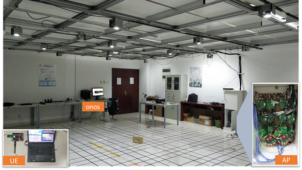
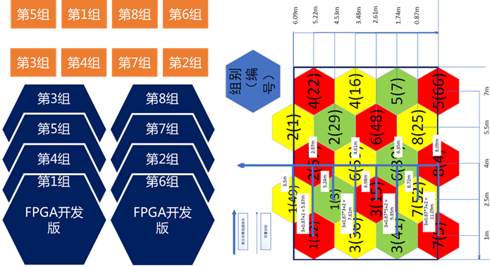
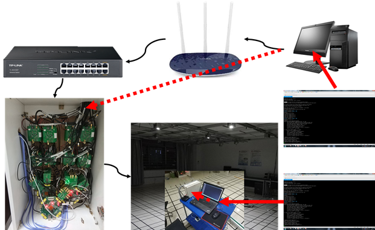
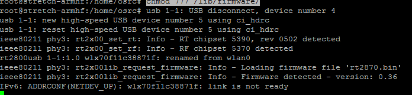
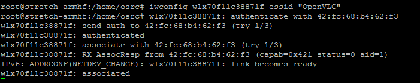
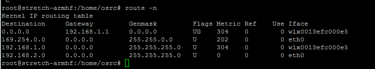

# 组网平台配置手册

## 平台硬件搭建



组网平台包括上面图中ONOS(台式电脑)、AP机柜（8个AP开发板+1个全局时钟控制板+多口交换机）、以及UE端组成。台式电脑通过网线连接交换机，进而和AP机柜中的AP网线连接。下面图所示为AP机柜中开发板与驱动板布线对照示意图，右下图为相应的分组号所在的LED灯组所在房间的位置。每组开发板的相应IP地址和MAC地址对照表如下面的表格所示。



| 第3组 | 192.168.1.154（00:0a:35:00:00:04） | 第8组 | 192.168.1.158（00:0a:35:00:00:08） |
| :---: | ---------------------------------- | ----- | ---------------------------------- |
| 第5组 | 192.168.1.153（00:0a:35:00:00:03） | 第7组 | 192.168.1.157（00:0a:35:00:00:07） |
| 第4组 | 192.168.1.152（00:0a:35:00:00:02） | 第2组 | 192.168.1.156（00:0a:35:00:00:06） |
| 第1组 | 192.168.1.151（00:0a:35:00:00:01） | 第6组 | 192.168.1.155（00:0a:35:00:00:05） |

下图是组网调试控制示意图。在进行控制器和可见光组网平台调试时，需要对AP端和UE端的代码做实时更新，这时候，UE端是通过1.有线网口远程控制传输源代码文件。2.通过串口控制Linux命令行。对于AP端Linux，目前大多只需要台式电脑通过ssh远程控制，因为AP端无需配置路由表，UE端存在wifi网卡和有线网卡，ssh控制相对而言不够可靠。



## AP-UE镜像制作

#### AP镜像制作

------

##### 前期准备

1. 内核编译

> USB转WIFI无线网卡驱动程序（内核自带RT5370驱动程序添加）的移植记录之二
>
> https://blog.csdn.net/qq_37375427/article/details/79592706
>
> 注意需要勾选某个协议扩展扩展选项

##### 系统配置

1. 配置开机自启动文件

> [Debian 9/Ubuntu 17+添加rc.local开机自启的方法](https://www.moerats.com/archives/623/)

@ 添加rc-local.service

```bash
#以下为一整条命令，一起复制运行
cat > /etc/systemd/system/rc-local.service <<EOF
[Unit]
Description=/etc/rc.local
ConditionPathExists=/etc/rc.local
 
[Service]
Type=forking
ExecStart=/etc/rc.local start
TimeoutSec=0
StandardOutput=tty
RemainAfterExit=yes
SysVStartPriority=99
 
[Install]
WantedBy=multi-user.target
EOF
```

@ 新建rc-local文件

```bash
#以下为一整条命令，一起复制运行
cat > /etc/rc.local <<EOF
#!/bin/sh
#
# rc.local
#
# This script is executed at the end of each multiuser runlevel.
# Make sure that the script will "exit 0" on success or any other
# value on error.
#
# In order to enable or disable this script just change the execution
# bits.
#
# By default this script does nothing.

sudo insmod /home/osrc/irq_dev.ko

sudo ifconfig eth0 down

sudo ifconfig eth0 hw ether 00:0a:35:00:01:03

#sudo ifconfig eth0 192.168.1.162

sudo ifconfig eth0 up

exit 0
EOF
```

@ 添加权限并设置开机自启

```bash
chmod +x /etc/rc.local
systemctl enable rc-local
systemctl start rc-local.service
```

@ 检查状态

```bash
systemctl status rc-local.service
```

@ 返回Active:active信息，则成功。最后我们就可以在/etc/rc.loacl里，添加开机的自启命令什么的了。记住添加在exit 0之前。

2. ssh拷贝AP程序和FPGA驱动文件


#### UE镜像制作

------

##### 前期准备

##### 系统配置

1. 配置开机自启动文件(参考AP配置，但一个区别是UE开启时不要初始化IP，这一过程在下面配置，以避免混淆)
2. 固件配置参考

> 嵌入式Linux开发板使用WIFI无线网卡访问互联网和作为个人热点
>
> https://m.ydaobo.com/wenzhang/11685.html

​	拷贝wifi驱动相关文件到目录

```shell
# 创建wifi驱动相关文件夹
mkdir /lib/firmware/
# 修改文件夹权限
chmod 777 /lib/firmware/
```

​	然后插上网卡可以看到



​	然后是WIFI配置工具安装

```bash
sudo apt-get install wireless-tools
```

​	连接路由器，可以看到已经连上了

```bash
iwconfig wlan0 essid "OpenVLC"
# OWCNC 为WIFI的AP热点 ，联调时根据路由名称的不同修改
```




3. 设置网关及IP地址（[参考](https://www.linuxidc.com/Linux/2012-03/57718.htm)）

```shell
 vi /etc/network/interfaces
 
#内容为
auto wlx70f11c388072
iface wlx70f11c388072 inet static
address 192.168.1.163
netmask 255.255.255.0
#下面的广播可以省略掉
broadcast 192.168.1.255
gateway 192.168.1.1


auto eth0
iface eth0 inet static
address 192.168.2.163
netmask 255.255.255.0

```

4. 设置路由（[参考](https://blog.csdn.net/sandy9919/article/details/82113546)）

```shell
vi /etc/iproute2/rt_tables

#内容为
#
# reserved values
#
255     local
254     main
253     default

#double route tables
252     wire
251     wifi
0       unspec
#
# local
#
#1      inr.ruhep
```

5. 新建路由表

```shell
vi /etc/init.d/networking

# 添加内容为
ip route flush table wifi
ip route add default via 192.168.1.1 dev wlx70f11c388072 src 192.168.1.163 table wifi
ip rule add from 192.168.1.163 table wifi
 
ip route flush table wire
ip route add default via 192.168.2.1 dev eth0 src 192.168.2.163 table wire
ip rule add from 192.168.2.163 table wire

```

6. 查看路由表情况

```shell
route -n
```



> 注意需要保证路由表中和路由器连接的网卡只和wifi相连，而数据发送给电脑的IP与有线网卡绑定，另外需要保证networking中的网关只有一个，那就是wifi网关就可以。

​	通过以下命令删除多余的路由表项，避免双网卡同时处理相同的包

```shell
route del -net 192.168.1.0 netmask 255.255.255.0 dev eth0
```

7. 安装iwconfig工具
8. ssh拷贝UE程序文件和驱动文件（wifi的bin文件和FPGA驱动）

```shell
scp filename osrc@192.168.1.155:/home/osrc/target_folder
```

###### 附：无线网卡手动配置[1](https://www.jianshu.com/p/6b62f6960b48)

```bash
# 1. 静态IP地址的绑定
sudo vi /etc/network/interfaces

    #文本内容为
    # 第一个网卡
    auto wlan0
    allow-hotplug wlan0           # 允许热插拔（非必须配置） 
    iface wlan0 inet static       # 采用静态IP分配的方式
    address  192.168.199.249      # 为树莓派设置的ip （详见下面介绍）
    netmask  255.255.255.0        # 子网掩码 （详见下面介绍）
    gateway  192.168.199.1        # 网关地址 （详见下面介绍）
    wpa-ssid  yourssid            # 你要连接的wifi名称
    wpa-psk   yourpassword        # 你要连接的wifi密码
# 2. 重启网卡 
	sudo ifup wlan0
```


