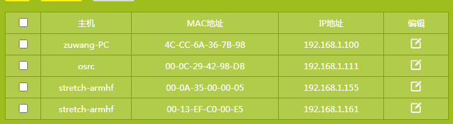
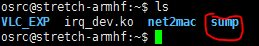

## 组网视频传输配置

**PS.** **配置过程中虚拟机、AP端Linux系统、UE端Linux系统的登录账号(osrc)和密码(root)均相同**

配置前需要打开wifi路由器配置界面（密码：1009ustc），应用管理-IP与MAC绑定表格中应如下图所示

1. 首先打开机柜中AP端开发板电源和交换机电源，并把全局时钟控制器开发板电源打开；
2. 通过xshell控制AP端运行MAC层代码，代码在下图文件夹中，获取root权限后执行./a.out；

1. 打开虚拟机，运行服务器端视频传输程序；

   

2. 打开UE端电源，进行UE端的配置；

3. UE端配置好以后，打开视频传输控制端

4. 关闭控制端时使用Ctrl+C

